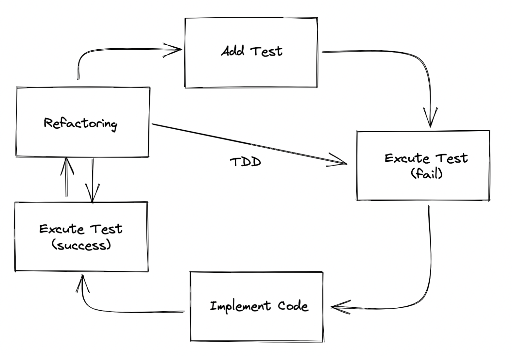

# 5장

5장에서는 무엇을 배우는가?

- **비즈니스 규칙 엔진**을 직접 구현
- **TDD** 기법으로 새로운 설계 문제를 풀어나가는 방법
- 유닛 테스트를 구현하는 데 유용한 **모킹** 기법
- **최신** 자바 기능 (지역 변수 형식 추론, switch문 등)
- **빌더 패턴**
- **인터페이스 분리 원칙**으로 사용자 친화적인 API 개발 방법

비즈니스 규칙 엔진?

- 비즈니스 규칙 엔진을 완성하면 비즈니스 팀에서 **직접 원하는 규칙을 만들 수 있으므로** <u>생선성을 높이고</u> 새로운 규칙을 <u>구현하는 시간을 단축</u>

## 비지니스 규칙 엔진 요구 사항

그래서 이 장에선 무엇을 달성할 것 인가?

- 개발자가 아닌 사람도 자신의 워크플로에 비지니스 로직을 추가하거나 바꿀 수 있는 기능을 만든다.

무엇을 제공하려 하는가?

- 비지니스 규칙 엔진(*규칙 기반 관리 시스템 - RBMS*)으로 간단한 맞춤 언어를 사용하여 한 개 이상의 **비지니스 규칙**을 실행하는 소프트웨어로 다양한 컴포넌트를 동시에 지원하자

비지니스 규칙들?

- **팩트** : 규칙이 확인할 수 있는 정보
- **액션** : 수행하려는 동작
- **조건** : 액션을 언제 발생시킬지 지정
- **규칙** : 실행하려는 비지니스 규칙을 지정. 보통 팩트, 액션, 조건을 한 그룹으로 묶어 규칙으로 만듦.

비즈니스 규칙 엔진이 생산성과 관련된 좋은점?

- 규칙이 응용프로그램과는 **독립된 곳**에서 실행, 유지보수, 테스트할 수 있다는 점

## 테스트 주도 개발(TDD)

TDD 철학이란?

- 테스트 코드를 먼저 만든 후, 이에 맞춰 코드를 구현하는 것
- 즉, 실제 코드를 구현하기 전에 테스트 코드를 먼저 구현

### 1. TDD를 사용하는 이유

귀찮지만 어마어마한 **보상**과 **장점**이 있다.

- 테스트를 따로 구현하므로 테스트에 대응하는 요구 사항을 한 개씩 구현할 때마다 필요한 요구 사항에 집중하고 개선할 수 있다.
- 코드를 올바르게 조작할 수 있다. 예를 들어 먼저 테스트를 구현하면서 코드에 어떤 공개 인터페이스를 만들어야 하는지 신중히 검토하게 된다.
- TDD 주기에 따라 요구 사항구현을 반복하면서 종합적인 테스트 스위트를 완성할 수 있으므로 요구사항을 만족시켰다는 사실을 조금 더 확신할 수 있으며 버그 발생 범위도 줄일 수 있다.
- 테스트를 통과하기 위한 코드를 구현하기 때문에 필요하지 않은 테스트를 구현하는 일(오버엔지니어링)을 줄일 수 있다.

> **Test Suite**
>
> 소프트웨어 개발에서 테스트 스위트는 덜 일반적으로 유효성 검사 스위트로 알려져 있으며 소프트웨어 프로그램을 테스트하여 특정 동작 세트가 있음을 보여주기 위한 테스트 케이스 모음입니다. [위키백과(영어)](https://en.wikipedia.org/wiki/Test_suite)

### 2. TDD 주기

리팩터링을 추가한 TDD 주기

- 실패하는 테스트 구현
- 모든 테스트 실행
- 기능이 동작하도록 코드 구현
- 모든 테스트 실행

하지만 실생활에서는 코드를 항상 **리팩터링**해야 하기 때문에 아래와 같은 모습을 보인다.



결과를 반환하지 않는 동작(행위)를 테스트 할려면?

- **`모킹`**이라는 새로운 기술이 필요하다.

## 모킹

모킹이란?

- `run()`과 같은 행위 메서드가 실행되었을 때 이를 확인하는 기법
- 그래서 구현하려는 비즈니스 규칙에 액션을 추가할 때마다 `run()`이 실행되었는지 확인한다.

어떻게 모킹 기술을 쓸 것 인가?

- 자바의 유명한 모킹 라이브러리인 **`모키토(Mockito)`**를 이용

How to use Mocking?

1. Mock 생성
2. 메서드가 호출되었는지 확인

<!--TODO: Mock Stub Spy Fake Dummy 좀 더 알아 오세용-->

Code

1. 라이브러리 임포트
2. 정적 메서드 `mock()` 로 필요한 목 객체를 만듦
3. `verify()` 로 특정 동작(메서드)이 실행되었는지 확인하는 어서션을 만든다.

```java
// 1. import library
import static org.mockito.Mockito.*;

public class ActionTest {
  // ...
  @Test
  void shouldExecuteOneAction() {
    final BusinessRuleEngine businessRuleEngine = new BusinessRuleEngine();
    // 2. make mock object
    final Action mockAction = mock(Action.class); // given
    
    businessRuleEngine.addAction(mockAction); // when
    businessRuleEngine.run(); // when
    
    // 3. verify method
    verify(mockAction).perform(); // then
  }
}

```

<!--TODO: What is static import?-->

모키토를 사용해서 뭐가 나아졌는데?

- 비즈니스 규칙 엔진이 실행될 때 Action 객체의 perform() 메서드가 호출되었는지 확인할 수 있다.
- 메서드가 몇 번 호출되었는지, 어떤 인수가 제공되었는지 등 조금 더 복잡한 검증 로직도 실행할 수 있다.

## 조건 추가하기

### 1. 상태 모델링

### 2. 지역 변수 형식 추론

### 3. switch 문

### 4. 인터페이스 분리 원칙(ISP)

## 플루언트 API 설계

### 1. 플루언트 API란

### 2. 도메인 모델링

### 3. 빌더 패턴

