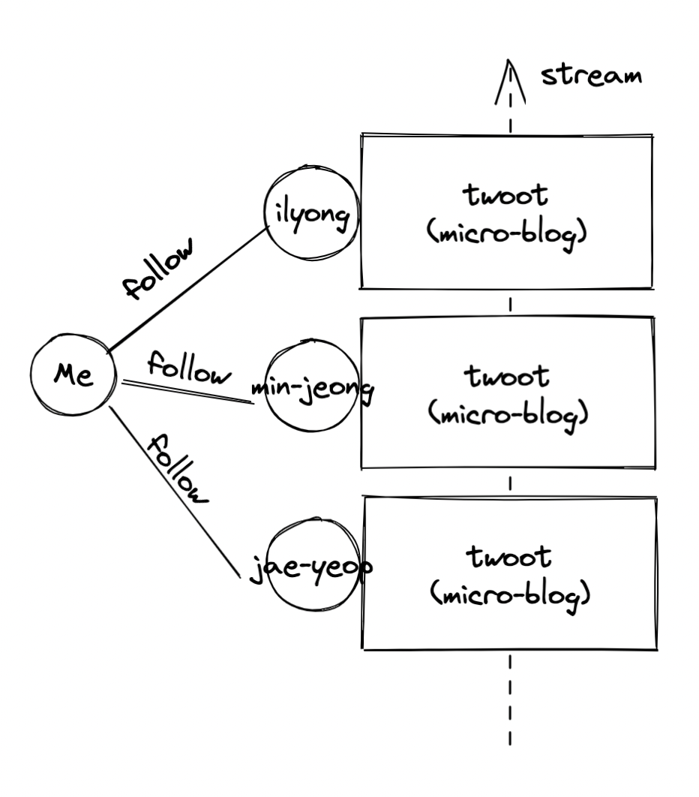

# 6장

6장에서는 무엇을 배우는가? ~~(트위터 짭 트우터Twootr 만든뎅! 대박)~~

- 큰 그림을 서로 다른 작은 아키텍처 **문제로 쪼개는 방법**
- 테스트 더블 (**모킹**)으로 코드베이스의 **다른 컴포넌트와의 상호작용을 고립하고 테스트하는 방법**
- 요구 사항이 응용프로그램 **도메인 코어**로 이어지도록 뒤집어 생각하는 방법

## 트우터 요구 사항



요구 사항은?

- 고유의 사용자 ID와 비밀번호로 트우터에 로그인한다.
- 각 사용자는 자신이 팔로우하는 사용자 집합을 가즌ㄴ다.
- 사용자는 트웃을 전송할 수 있으며 로그인한 모든 팔로워는 이 트웃을 바로 볼 수 있다.
- 사용자가 로그인하면 최종 로그인한 이후로 게시된 팔로워의 모든 트웃을 볼 수 있다.
- 자신의 트웃을 삭제할 수 있다. 팔로워는 삭제된 트웃을 볼 수 없다.
- 사용자는 모바일이나 웹사이트로 로그인할 수 있다.

## 설계 개요

마지막 요구 사항인 ""로그인할 수 있다..." hmm...🤔 다양한 환경의 사용자가 어떻게 서로 통신할 수 있을까?

- 보통 이런 문제를 **`Client-Server model`**로 해결한다.

**클라이언트 서버 모델**이란?

- 두 그룹으로 분류한다.
- **클라이언트 그룹**은 서비스를 사용하는 그룹
- **서버**는 관련 서비스를 제공하는 그룹

### 1. 풀 기반

**`풀 기반 통신`**에서는

- 클라이언트가 서버로 정보를 요청한다.
- 사용자의 선택에 따라 요청한 내용이 응답으로 제공된다.

### 2. 푸시 기반

**`푸시 기반 통신`**에서는

- 작성자가 방출한 이벤트 스트림을 여러 구독자가 수신한다.
- 이를 Reactive 또는 Event-Driven 통신이라고 부른다.

이러한 통신의 장점은?

- 여러 컴포넌트 간에 다양한 이벤트의 의사소통이 발생하는 상황에서 특히 유용하다.
- 필요할 때마다 요청하는 것이 아니라 연속적으로 정보가 제공되는 상황에서 유용

## 이벤트에서 설계까지

우리는 클라이언트 개발보단 서버 컴포넌트 개발에 더 집중한다. 왜? 이 책이 자바 책이니까! ㅋㅋ

### 1. 통신

다양한 기술들이 있다.

- 웹소켓 <!--TODO: WebSocket 조사 -->
  - TCP 스트림으로 양방향 이베트 통신을 지원하는 가벼운 통신 프로토콜.
  - 웹 서버와 웹 브라우저 사이의 이벤트 주도 통신에 주로 사용.
- 단순 큐 서비스(Simple Queue Service)
  - 호스트된 클라우드 기반 메시지 큐를 메시지 송출이나 수신에 사용
  - 메시지 큐는 그룹내의 프로세스 중 한 프로세스가 전송된 메시지를 받아 처리하는 상호 프로세스 통신 방식
  - 호스트된 서비스를 이용하면 안정적인 호스팅을 제공하기 위해 직접 관리하지 않아도 되므로 **편리**! (아 이거지 ㅋㅋ)
- 메시지 큐
  - 오픈 소스 프로젝트는 특정 벤더 회사에 의존하지 않아도 된다는 장점.
  - 대신 메시지 큐로 상호작용할 수 있는 클라이언트 선택에 제한이 있을 수 있다.

그래서 우리는?

- 웹 사이트와 서버는 **웹소켓**, 
- 모바일 어플과는 **안드로이드 푸시 노티피케이션** 으로 통신한다.

### 2. GUI

UI를 서버의 비지니스 로직과 결합하면 단점이 있데!

- 테스트하기 어렵고 테스트 실행도 느림
- SRP 원칙을 위반
- 미래엔 클라이언트가 UI를 안가질 수 도 있음!

결론적으로

- 메시징을 코어 비즈니스 로직과 분리할 수 있도록 신중하게 추상화해야 함.
- **즉, 클라이언트에게 메시지를 전송하고 클라이언트의 메시지를 수신하는 인터페이스가 필요하다.** (핵심)

### 3. 영구 저장

수신한 데이터를 어떻게 저장할까?

- 직접 인덱스하고 검색할 수 있는 일반 텍스트 파일
- 전통적인 SQL DB
- NoSQL 데이터베이스 : 다양한 <u>유스 케이스</u>, <u>질의 언어</u>, <u>데이터 저장 모델</u>을 지원

### 4. 육각형 아키텍처

<!--TODO: 육각형 아키텍처 조사!-->

앨리스터 콕번(Alister Cockburn)이 정립한 `포트와 어댑터` 또는 `육각형 아키텍처`라 불리는 조금 더 일반화된 아키텍처를 적용해 이 문제를 해결할 수 있다.

육각형 아키텍처?

- 이 아키텍처에서 응용프로그램의 코어는 우리가 구현하는 비즈니스 로직이고,

- 다양한 구현은 코어 로직으로부터 분리되어 있다.

  

- 코어 비즈니스 로직과 분리하려는 특정 기술이 있다면 **`포트`**를 이용한다. 외부 이벤트는 포트를 통해 코어 비즈니스 로직으로 전달 된다.

- **`어댑터`**는 포트로 연결하는 특정 기술을 이용한 구현 코드

이 아키텍처를 이용하려면

- **<u>포트</u>**와 **<u>어댑터</u>**를 추상화해야 한다.
  - 나중에 notification 시스템을 확장할 계획에 쓰임
- 인증 서비스에서도 포트를 활용할 수 있다.

그러면 어떤 기능을 포트로 지정하고 어떤 기능을 코어 도메인으로 분리해야할까?

- 비즈니스 문제를 해결하는 데 꼭 필요한 기능을 응용프로그램의 코어로 분류
- 나머지 특정 기술에 족송된 기능이나 통신 관련 기능은 코어 응용프로그램의 외부 세계로 분류하는 것이 일반적인 관례.

## 작업 순서

설계를 더 구체화하고 다이어그램을 세부적으로 완성하면서 어떤 클래스로 무슨 기능을 구현할지 결정할 차례

- Test Class를 먼저 구현하는 것이 바람쥑 하쥐? 히히!

이미 포트로 아키텍처 결정과 UI 통신을 분리했다. 그럼 API를 어떻게 정의해야 할까?

- 사용자가 기능을 어떻게 쓸 것인가를 생각하고 기능을 만들면 된다. (예: 알리는 기능, 발송하는 기능, 수신하는 기능)

포트와 어댑터의 최종 목표는?

- 응용프로그램의 코어와 특정 어댑터 구현의 결합을 제거하는 것
- 즉 추상 클래스보다 더 유연한 **인터페이스**로 다양한 어댑터로 추상화 해야한다.
- 또한 인터페이스를 사용하면 언젠가 API에 상태를 추가하려는 악의적인 행동을 막을 수 있다..네?

TDD는 소프트웨어 설계를 방해한다는 비판을 받는데,,

- 테스트 구현에 초점을 맞춰 `빈약한 도메인 모델`을 만들게되고 결국 코드를 다시 구현하게 된다고 한다는데..
  - 빈약한 도메인 모델이란, 비즈니스 로직을 갖지 않으며 다양한 메서드에 절차적 형식으로 흩어져 정의된 도메인 객체
- 이는 TDD에서 개선해야할 부분이다.
  - 적절한 시점에 도메인 클래스를 추가하거나 개념을 코드로 구현하는일 자체는 그렇게 중요한 작업이 아니다.
  - 하지만 사용자 스토리가 항상 참조하는 어떤 개념이 있다면 문제는 도메인에서도 이를 어떤 방식으로 표현할 수 있어야 하죠

## 비밀번호와 보안

어떻게 안전하게 비밀번호 보안을 지킬 수 있을까?

- 비밀번호에 암호화 해시 함수를 적용하면 데이터베이스에 접근한 사람이 비밀번호를 읽지 못하게 방지할 수 있다.
- 임의의 길이의 문자열을 입력받아 `다이제스트`라는 출력으로 변환하는 기능
- 항상 같은 결과를 출력하므로 이 기능에 동일한 값을 입력하면, 이전과 같은 결과가 나온다.
- 그리고 **`솔트`**(Salt)로 무차별 대입으로 키를 맞추거나, 레인보 테이블로 해싱된 값을 되돌릴 수 있는 취약점을 방지할 수 있다.
  - 솔트란 암호 해싱 함수에 적용하는 임의의 생성된 추가 입력이다.

웹 소켓을 쓴다면 중간자 공격을 받을 수 있다.

- 그래서 TLS 전송 계층 보안을 통해 암호화된 프로콜을 사용할 수 있겠지,,?

## 팔로워와 트웃

보통 소프트웨어 설계를 크게 두 가지 방법으로 접근

- 상향식
  - 코어 설계에서 시작해 시스템 전체를 만드는 방법
  - 실질적으로 소프트웨어의 동작에 필요 없는 부분까지 만들 수 있음.
- 하향식
  - 사용자 요구 사항이나 스토리에서 출발해 구현하는 데 필요한 동작이나 기능을 먼저 개발하고, 점차 저장소나 데이터 모델을 추가
  - 저자의 경험상 영업과 관련된 형식의 자바 애플리케이션에서는 하향식이 좋데
  - 요구 사항과 스토리를 구현하면서 초기 버전의 설계 방식에 문제가 있음을 발견하게 된다는 단점.
  - 그래서 현재 설계에 안심하지 않고 반복적으로 개선하기 위해 노력해야 함.

### 1. 오류 모델링

예외적인 제어 흐름에만 예외를 사용하는 것이 일반 적이며, 잘 설계된 UI에서는 웬만해서 이런 시나리오를 피한다.

예외가 아닌 다른 방식으로 상태를 표현할 수 있는 방법

- 불리언 
  - 왜 이 동작이 실패했는지 알려줄 수 없다.
- int 상수값
  - 가독성과 유지보수성 낮다.
- enum
  - 안전한 형식과 좋은 문서화를 제공한다.
  - Interface, class에서 사용 가능!
  - 추가적으로 enum에서 유용한 기능을 추가할 수 있도록 인스턴스 필드와 메서드 정의를 포함할 수 있다.

### 2. 트우팅

트웃이 발생했음~~(행위네? 그럼 mock이지)~~을 알기위해 테스트를 어떻게 구현할까?

### 3. 목(Mock) 만들기

목 객체는

- 다른 객체인 척하는 객체
- 원래 객체가 제공하는 메서드와 공개 API를 모두 제공
- 이를 이용해 특정 메서드가 실제 호출되었는지를 확인(verify) 한다.

목만들기 아주아주 귀찮아

- 그래서 아주아주 좋은 Mockito 오픈 소스 라이브러리가 있지요
- 정적 임포트해서 사용해야해!
- `import static ~~~`

### 4. 목으로 확인하기

테스트는

- 정해진 동작(테스트의 when 부분)을 실행한 다음
- 테스트할 메서드가 실제 호출되었는지(then 부분) 확인 -> `Mockito.verify()`

### 5. Mocking 라이브러리

- PowerMock
  - final 클래스나 정적 메서드 목 기능을 제공
  - final 클래스에 목을 지원하는 것이 올바른지 의견이 분분... ㅋㅋ;;
- EasyMock
  - 엄격한 모킹을 장려
  - 엄격한 모킹이란 명시적으로 호출이 발생할 거라 선언하지 않은 상태에서 호출이발생했을 때 이를 오류로 간주하는 것 

### 6. SenderEndPoint 클래스

깃 허브 레포지터리 참고

## Position 객체

이 객체는 

- 사용자가 로그아웃한 후 어떤 트웃이 발생했는지 시스템이 알아야할 때, <u>마지막으로 확인한 트웃의 위치를 저장하는 역할</u>을 한다.

이 객체는 값 객체(Value object)인데,

- 여러 필드의 값을 합치거나 관련 도메인명을 숫자로 표현하는 작은 객체를 유용하게 사용할 수 있다. (e.g Point 같은 클래스)

### 1. `equals()`와 `hashCode()` 메서드

이게 문제다.

```java
final Point p1 = new Point(1, 2);
final Point p1 = new Point(1, 2);
System.out.println(p1 == p2); // false
```

- 모든 객체는 java.lang.Obect을 상속받고 이 Object에서 상속받은 `equals()`, `hashCode()` 메서드는 참조되는 값으로 두 객체가 같은지 판단하도록 구현 됨.

객체를 비교할 때는

- **참조 객체**와 **값 객체**로 구분하면 편리
- `equals()` 메서드를 오버라이드해서 값이 같은지 비교

### 2. `equals()`와 `hashCode()` 메서드 사이의 계약

`equals()`뿐 아니라 `hashCode()` 메서드도 오버라이드 했는데 왜?

- 자바의 `equals()`와 `hashCode()` **계약** 때문
- `equals()` 로 같다고 판단했을 때   `hashCode()` 메서드 역시 같은 값을 반환해야 한다.
  - `hashCode()`는 HashMap, HashSet 등의 컬렉션 구현을 포함한 많은 코어 자바 API가 `hashCode()`를 사용한다.

안하면?

- 예상치 못한 버그 터짐 -> 팀장님 한테 혼남 -> 고가 평가 -> 짤림


