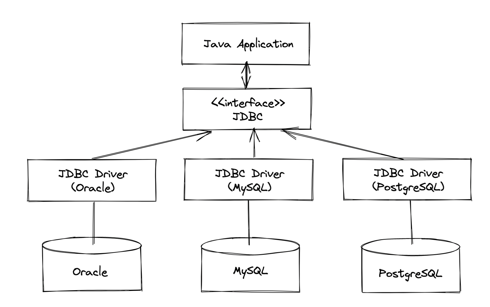

# 7장

7장에서는 무엇을 배우는가? 

- 의존관계 역전 원칙(`DIP`)
- 의존관계 주입(`DI`)으로 결합도 피하기
- `Repository Pattern`(저장소 패턴), `Query Object Pattern`(쿼리 객체 패턴)으로 데이터 영구 저장
- `Functional Programming`(함수형 프로그래밍)이 무엇인지, 자바에서 적용하는 방법


## 이전 줄거리

- `Twootr`는 비즈니스 로직을 인스턴스화하고 시스템을 조정하는 부모 클래스
- `Twoot`은 사용자가 시스템에서 발송한 하나의 메시지 인스턴스
- `ReceiverEndPoint`는 UI 어댑터가 구현해야 하는 인터페이스로 `Twoot`객체로 UI로 푸시
- `SenderEndPoint` 는 사용자가 시스템으로 전송한 이벤트에 대응하는 메서드를 포함.
- `KeyGenerator` 클래스는 비밀번호 관리와 해싱을 담당


## 영구 저장과 저장소 패턴

프로세스를 재시작해도 정보가 사라지지 않도록 저장하려면?

- **포트와 어댑터**로 저장소 백엔드 선택하여 <u>도메인 코어에 영향이 미치지지 않도록 설계.</u>
- `Repository Pattern`을 이용

**<u>`Repository Pattern`</u>** 이란?


- 도메인 로직과 저장소 백엔드 간의 인터페이스를 정의
- 저장소 패턴을 이용하면 나중에 응용프로그램의 저장소를 다른 저장소 백엔드로 쉽게 갈아탈 수 있음 (DIP 적용)

여긴 개구리 책 발췌.

- 
  - Oracle JDBC Driver 는 추상적인 JDBC Interface에 의존하게 되면서 의존의 방향이 역전 됨.
  - 그리고 자바어플리케이션은 자신보다 변하기 쉬운 JDBC Driver에 의존하던 관계를 중간에 추상화된 JDBC Interface 를 추가해 두고 의존 관계를 역전시키고 있음.
  - 이 처럼, 자신보다 변하기 쉬운 것에 의존하던 것을 추상화된 인터페이스나 상위 클래스를 두어 <u>변하기 쉬운 것의 변화에 영향받지 않게 하는 것</u>이 **`의존 역전 원칙`**.

저장소 패턴의 **장점**은?

- 저장소 백엔드를 도메인 모델 데이터로 매핑하는 로직을 중앙화(centralize)함.
- 실제 데이터베이스 없이도 코어 비즈니스 로직을 유닛 테스트하므로 빠르게 테스트를 실행할 수 있음.
- 각 클래스가 하나의 책임을 가지므로 유지보수성과 가독성이 좋아짐.

그래서 트우터에서는?

- 저장소 패턴을 사용하여 객체를 CRUD 기능을 구현한다.

### 1. 저장소 설계

설계 방식?

- 하향식, 테스트 주도로 저장소를 설계 한다.
- 하향식을 통해 사용하지 않는 코드를 구현되지 않도록 한다. (6장 상향식, 하향식 설명)

**YAGNI** ?

- **Y**ou **A**ren't **G**onna **N**eed **I**t 
- 미래에 사용할 것 같은 기능을 구현하지 말고 **정말로 사용해야 할 때 그 기능을 구현**하라는 의미.

**`데이터 계층`**(Data Layer)은


- 트우터 객체 시퀀스를 만드는 적절한 도구를 가지므로 고유 객체를 만드는 일을 데이터 계층에 위임

Generic Interface로 Repository Pattern을 구현

```java
public interface AbstractRepository<T> {
  void add(T value); // C
  
  Optional<T> get(String id); // R
  
  void update(T value); // U
  
  void delete(T value); // D
}
```

- 다양한 저장소를 추상화하는 코드가 필요하다면 이 방법을 활용.
- <u>단지 저장소라는 이유로 한 인터페이스를 구현하도록 강요한다면</u> 좋은 추상화 설계라고 할 수 없다.

### 2. 쿼리 객체

쿼리 기능을 각 저장소에 구현 하는 방법

- 1️⃣ 저장소를 마치 **컬렉션**처럼 구현한 다음, 여러 Twoot 객체를 반복하며 필요한 작업을 수행하는 방법

  - 간단하지만 속도가 현저히 느림
  - 데이터베이스 같은 저장소 백엔드는 쿼리와 정렬 기능의 효율성이 높으므로 기존의 쿼리 기능을 그대로 활용하는 것이 바람직.

- 2️⃣ 쿼리 수행 비즈니스 로직에 대응하는 메서드를 추가하는 방법

  ```java
  public interface TwootRepository {
    List<Twoot> twootsForLogon(User user);
  }
  ```

  - 특정 비즈니스 로직 기능이 저장소 구현과 결합되는 단점이 생김.
  - 요구사항 변경에 따라 도메인뿐만 아니라 저장소도 바꿔야 하므로 유지보수 어려움. -> SRP 위배

- 3️⃣ 주어진 비즈니스 조건으로 저장소를 쿼리하는 메서드를 추가하는 방법

  ```java
  public interface TwootRepository {
    List<Twoot> twootsFromUsersAfterPosition(Sets<String> inUsers, Position lastSeenPosition);
  }
  ```

  - 데이터 저장소와 비즈니스 로직을 결합하지 않으면서 데이터 저정소의 쿼리 기능을 활용할 방법이지만
  - 각 쿼리를 메서드로 하드코한다면 저장소에 더 많은 메서드를 추가해야 하므로 코드가 거대해지고 이해하기 어려워짐.

- 4️⃣ 저장소로 쿼리할 조건을 객체 안에 추상화

  ```java
  // TwootRepository.class
  public interface TwootRepository {
    // ...
    List<Twoot> query(TwootQuery query);
  }
  
  // TwootQuery.java
  public class TwootQuery {
    private Set<String> inUsers;
    private Position lastSeenPosition;
    
    public Set<String> getInUsers() { return inUsers; }
    
    public Position getLastSeenPosition() { return lastSeenPosition; }
    
    public TwootQuery inUsers(final Set<String> inUsers) {
      this.inUsers = inUsers;
      return this;
    }
    
    public TwootQuery inUsers(String... inUsers) { // TODO: ... 연산자
  		return inUsers(new HashSet<>(Arrays.asList(inUsers)));
    }
    
    public TwootQuery lastSeenPosition(final Position lastSeenPosition) {
      this.lastSeenPosition = lastSeenPosition;
      return this;
    }
    
    public boolean hasUsers() {
      return inUsers != null && !inUsers.isEmpty();
    }
  }
  ```

  - 메서드를 추가할 필요 없이 메서드 하나의 다양한 추가 속성으로 쿼리를 수행할 수 있음
  - 최종 설계는 아니고, 모든 Twoot 객체를 메모리에 저장하는 대신 <u>각 객체를 UI로 푸시</u>해 메모리 문제를 해결할 수 있음.
  - 일부 저장소는 결과 집합을 모델링하는 객체를 갖도록 구현. (Entity를 말하는 건가?)

- 5️⃣ 함수형 인터페이스 중 Consumer를 이용

  ```java
  // TwootRepository.class
  public interface TwootRepository {
    // ...
    void query(TwootQuery twootQuery, Consumer<Twoot> callback);
  }
  
  // Query Method 사용
  twootRepository.query(
  	new TwootQuery()
    	.inUsers(user.getFollowing())
    	.lastSeenPosition(user.getLastSeenPosition()), // twootQuery
    user::receiveTwoot // callback
  )
    
  public class User {
    
    private Position lastSeenPosition;
    private ReceiverEndPoint receiverEndPoint;
    
    // ...
  
    boolean receiveTwoot(final Twoot twoot) {
      if (isLoggedOn()) {
        receiverEndPoint.onTwoot(twoot);
        lastSeenPosition = twoot.getPosition();
        return true;
      }
  
      return false;
    }
  
    // ...
  }
  ```

  - `Consumer<Twoot>` Callback으로 한 개의 인수(`Twoot`) 를 받아 `void`를 반환
  - 쿼리의 결과는 `user::receiveTwoot` 메서드 레퍼런스로 받으며 이는 Twoot 객체를 UI ReceiverEndPoint로 발행 함. (대박 ㅋㅋ)

Repository 구현 기법 중 **<u>`Unit of Work Pattern(작업 단위 패턴)`</u>**

- 데이터베이스는 `ACID`를 준수하도록 <u>트랜잭션</u>을 구현
  - <u>트랙잭션</u>이란 논리적으로 한 개의 아토믹(atomic) 연산으로 취급할 수 있는 여러 데이터베이스 연산의 그룹
- <u>작업 단위</u>는 데이터베이스 트랜잭션이 원활하게 수행되도록 돕는 디자인 패턴
- 기본적으로 Repository에 수행하는 모든 연산은 작업 단위 객체로 등록된다.

그래서 우리의 Repository를 어떻게 구현할 것 인가?

- 다양한 객쳬 관계 매핑(ORM) 중 하이버네이트는 가장 유명한 ORM 중 하나. (Java Persistence API 도 있다.)
- ORM을 이용하면 일부 작업을 자동화할 수 있지만, 쿼리 코드 결과물이 최적화가 완벽하지 못할 때도 있다. (맹신하지 말란 뜻.)


## 함수형 프로그래밍

함수형 프로그래밍이란

- 메서드를 수학 함수처럼 취급하는 컴퓨터 프로그래밍 형식
- 함수평 프로그래밍에서는 <u>가변 상태</u>와 <u>데이터 변경</u>을 피한다.

자바8 부터는 함수형 프로그래밍 구현에 도움을 주는 몇 가지 기능이 추가 됨.

- 람다 표현식
- 스트림 API와 Collector API
- Optional 클래스 등

왜 이런 기능을 제공하는가?

- 라이브러리 개발자가  활용할 수 있는 추상화 수준에 한계가 있었다.
  - 예: <u>큰 데이터 컬렉션</u>에서는 효과적으로 병렬 연산을 수행할 수 없었음.
- 메서드 호출 방식을 살짝 바꾸어 멀티코어 CPU를 효율적으로 활용하여 병렬 처리 라이브러리를 구현할 수 있게 됨.
- 스레드 안전(Thread safety)을 갖춘 복잡한 코드를 구현할 수 있음. -> 시간과 비용 절약

추상화를 얘기하자면,,

- **객체 지향 프로그래밍**에서는 보통 <u>데이터 추상화</u>를 얘기
- **함수형 프로그래밍**에서는 동작 추상화에 초점을 둠.
- 실전에는 두 가지 추상화 모두 필요.

그래서 추상화로 부터 얻을 수 있는 이익은

- 최적의 성능을 추구하기보단, 비즈니스 로직의 의도를 표현하기 위해 많은 시간을 쓰는데
- 추상화를 사용하여 읽기 쉬운 코드를 구현할 수 있으며 -> 이는 유지보수하기가 쉽고 -> 더 안정적이며 -> 오류가 적게 발생

### 1. 람다 표현식

익명 함수를 람다 표현식으로 줄여서 정의한다.

콜백을 표현하는 ReceiverEndPoint 인터페이스

```java

public interface ReceiverEndPoint {
  void onTwoot(Twoot twoot);
}

```

- 이 인터페이스의 `onTwoot()`는 `Twootr` 객체가 `Twoot` 객체를 UI 어뎁터로 보낼 때 이 메서드를 수행

위 인터페이스를 간단히 구현해봅시다.

```java
public class PrintingEndPoint implements ReceiverEndPoint {
  @Override
  public void onTwoot(final Twoot twoot) {
    System.out.println(twoot.getSenderId() + ": " + twoot.getContent());
  }
}
```

- 위 코드는 UI로 보내는 메시지의 동작을 다양하게 파리미터화 한 **`동작 파라미터화(Behavior Parameterization)`** 예제이다.

- 실제 동작은 한 줄이지만, 의미 없는 코드가 많음. 그래서

위의 문제점을 해결하기위해 자바는 **`익명 내부 클래스`**를 제공한다.

```java
final ReceiverEndPoint anonymousClass = new ReceiverEndPoint() {
  @Override
  public void onTwoot(final Twoot twoot) {
    System.out.println(twoot.getSenderId() + ": " + twoot.getContent());
  }
};
```

- 필요한 동작만 쉽게 표현하고 전달 할 수 있도록 **익명 내부 클래스** 기능을 사용했지만,
- 여전히 프로그래머의 의도를 이해하기 어려운 코드이다.

위의 문제점을 해결하기 위해 **`람다 표현식`**을 사용할 수 있다.

```java
final ReceiverEndPoint lambda = twoot -> System.out.println(twoot.getSenderId() + ": " + twoot.getContent());
```

- 인터페이스를 구현하는 객체를 전달하는 대신, 코드 블록을 전달.
- 간결해지고, 의도가 분명해졌다.

> 람다 메서드 파라미터는 불필요한 코드를 제거하면서도 정적 형식을 유지한다. 가독성, 친밀성이 중요하거나 컴파일러가 형식을 판단하기 어려울 때는 명시적으로 형식을 선언할 수 있다.

### 2. 메서드 레퍼런스

`twoot -> twoot.getContent()`와 같은 아주 자주 발생하는 간단한 표현은 

- `메서드 레퍼런스`라는 단축 구문으로 기존 메서드를 표현할 수 있다.
- `Twoot::getContent` **클래스 이름::메서드이름**

메서드 레퍼런스는

- 메서드이지만, 실제로 메서드를 호출하지 않으므로 괄호를 사용하지 않는다.

같은 단축 구문으로 생성자를 호출할 수 있음.

```java
(user -> twootr) -> new SenderEndPoint(user, twootr);
// 위랑 밑이랑 같은 표현
SenderEndPoint::new
```

- 읽기 아주 쉬워졌음.
- 람다 표현식 코드를 마치 데이터처럼 여기저기로 전달하는 상황에서 더 나아가 메서드를 직접 참조할 수 있다는 점이 아주 좋다네요

메서드 레퍼런스 덕분에

- 함수가 명시적으로 **일급의 개념(Concept for first-class)**으로 취급됨.
- 덕분에 마치 **값처럼 동작을 전달**하고 처리할 수 있어 두 개 이상의 함수를 조합할 수 있음.

### 3. 실행 어라운드

함수형 디자인 패턴에서 자주 사용되는데

- 항상 비슷한 작업을 수행하는 로직에서 실행 어라운드를 사용한다.

다음과 같은 상황들이 예시이다.

- 파일
  - 파일 열고 (+예외 처리)
  - 파일 사용 (`파라미터화된 코드`)
  - 파일 닫기 (+예외 처리)
- 락
  - 락 획득
  - 크리티컬 섹션 (`파라미터화된 코드`)
  - 락 해제
- 데이터베이스 연결
  - 데이터베이스 연결
  - 작업 (`파라미터화된 코드`)
  - 데이터베이스 닫기

비슷한 작업들은

- 코드 중복이 된다.
- 중복된 코드가 존재하면 코드의 일관성이 사라짐
- 잠재 버그가 생길 수 있다!!

실행 어라운드 패턴에서는

- 위와 같은 비슷한 코드에서 공통 메서드를 추출해 문제를 해결한다.
- 보통 람다 표현식의 코드 블록으로 필요한 기능을 구현할 수 있도록 인터페이스를 파라미터로 정의.

JDBC에서 보셨죵?

```java
try ( // 데이터 베이스 연결
  var connection = DriverManager.getConnection("jdbc:mysql://localhost/order_mgmt", "root", "root1234!");
  var statement = connection.prepareStatement(SELECT_ALL_SQL);
  var resultSet = statement.executeQuery() 
) {
  while (resultSet.next()) {
    // 작업
    var customerName = resultSet.getString("name");
    var customerId = UUID.nameUUIDFromBytes(resultSet.getBytes("customer_id"));
    var createdAt = resultSet.getTimestamp("created_at").toLocalDateTime();
    names.add(customerName);
  }
} catch (SQLException throwable) { // 예외 처리
  logger.error("Got error while closing connection", throwable);
}
// 자동으로 닫음.
```

### 4. 스트림

가장 중요한 함수형 프로그래밍의 기능은

- Collection API
- Stream API

스트림 덕분에

- 루프를 이용하지 않고 높은 수준으로 컬렉션 처리를 추상화할 수 있다.

스트림 API 종류

- `map()`
  - 스트림을 다른 형식의 값의 스트림으로 변환할 때
  - 전달한 람다 표현식은 `Function` 인스턴스여야 한다. 오직 한 개의 인수를 받음.
- `forEach()`
  - 스트림의 값에 부작용을 일으키는 작업을 수행할 때 이 연산을 활용
  - 스트림의 모든 요소를 인수로 받아 작업을 수행하는 `Consumer` 콜백을 한 개의 인수로 받음.
- `filter()`
  - 각 요소에 if문을 적용하는 상황에 이 연산을 활용
  - `true` / `flase`를 반환하여 요소들을 거름
- `reduce()`
  - 전체 리스트를 한 개의 값으로 줄이는 상황이라면 이 연산을 활용

스트림 연산을 합쳐 파이프라인을 구성하면 아주아주 편하고 강력한 기능을 쓸 수 있다.

### 5. Optional

Optional은 null을 대신하도록 자바 8에서 추가된 코어 자바 라이브러리 데이터 형식.

기존의 `null` 방식엔 많은 문제점이 있다.

- 보통 `null`로 <u>값이 없음</u>을 표현하는데 `null`을 사용하면 `NullPointerExceiption`이 발생할 수 있으며 이는 종료가 될 수 있다.

그래서 `null` 대신 `Optional`을 쓰는데 두 가지 기능을 제공한다.

- 버그를 피하기 위해 변수의 값이 있는지 개발자가 확인하도록 장려
- 클래스의 API에서 값이 없을 수 있다는 사실을 Optional 자체로 문서화한다.

사용 방법

- `of()` : 팩토리 메서드의 값으로 Optional 인스턴스를 만듬
- `empty() ` : Optional은 값을 갖지 않았을 때 사용
- `ofNullable()` : null이 될 수 있는 값을 Optional로 만들 수 있음.
- `isPresent()` : Optional이 값을포함하는지 확인
- `orElse()` : Optional이 비었을 때 대쳇값을 제공
- `orElseGet()` : 대쳇값 계산에 시간이 많이 걸린다면 Supplier 함수를 전달하여 제공

Optional은 스트림 API에 사용할 수 있는 메서드도 제공. 

- 비슷한 기능을 하지만 스트림이 오직 1개 또는 0개 요소만 포함할 수 있다는 점이 다름

> **📚 함수형 프로그래밍 참고 책**
>
> 모던 자바 인 액션, Java 8 Lambdas

## 사용자 인터페이스

자바스크립트로 동적 기능을 구현하는 단일 페이지 웹 사이트를 만들자.

- 관심사 분리 원칙을 지킴.

프론트엔드와 서버 간의 모든 통시는 **JSON** 표준으로 이루어짐. 

- 서버에서는 Jackson 라이브러리를 사용
- JSON은 이벤트 주도 방식보다는 <u>요청 응답 방식</u>의 응용프로그램에서 JSON을 주로 사용


## 의존관계 역전과 의존관계 주입

<u>결합을 제거하는 패턴</u>을 사용해보았다.

- <u>저장소 패턴</u>으로 비즈니스 로직과 세부 구현의 결합을 제거
- **의존관계 역전**은 이들 패턴을 아우르는 원칙.

**`Dependency Inversion Principle (의존관계 역전)`**

- 높은 수준의 모듈은 낮은 수준의 모듈에 의존하지 않아야 한다. 두 모듈 모두 추상화에 의존해야 한다.
- 추상화는 세부 사항에 의존하지 않아야 한다. 세부 사항은 추상화에 의존해야 한다.

만약 높은 수준의 모듈이 낮은 수준의 모듈에 의존한다면?

- 한 개의 큰 문제를 여러 작은 문제로 쪼개고 이 작은 문제를 각 모듈이 해결하도록 구현하면,
- 주요 문제 (높은 수준 모듈)가 작은 문제들(낮은 수준 모듈)을 의존하게 된다.

그래서 우리의 코드는

- `Twootr` 라는 높은 수준의 진입점 클래스를 만들었지만, 이 클래스는 `DataUserRepository` 같은 다른 낮은 수준의 모듈에 의존하지 않는다.
- 이는 구현이 아닌 `UserRepository <<interface>>` 처럼 추상화에 의존하기 때문

**`Dependency Injection (의존관계 주입)`**

- 인터페이스를 정의하고 구현을 분리하는 것으로는 부족. 즉 추상화, 결합 제거를 유지할 수 있도록 올바른 구현을 제공하는 방법이 필요.

  ```java
  public class Twootr {
    private final TwootRepository twootRepository; // 항상 데이터베이스 저장소를 사용하므로 느리게 작동한다.
    private final UserRepository userRepository;
    // 그리고 다양한 버전의 저장소를 사용하려면 여러 코드베이스를 준비해야함.
    
    public Twootr() { // 하드 코딩 ㅠㅠ
      this.userRepository = new DatabaseUserRepository(); // new MemoryUserRepository();
      this.twootRepository = new DatabaseTwootRepository();
    }
  }
  ```

- 디자인 패턴 중 **추상 팩토리 패턴** 으로 인스턴스화하는 방법이 있다.

  ```java
  public class Twootr {
      public Twootr() { // 하드 코딩 ㅠㅠ
        this.userRepository = UserRepository.getInstance();
        this.twootRepository = TwootRepository.getInstance();
      }
  }
  
  // 사용
  UserRepository.setInstance(new DatabaseUserRepository());
  TwootRepository.setInstance(new DatabaseTwootRepository());
  Twootr twootr = new Twootr();
  ```

  - 인터페이스와 구현을 분리했으며 원하는 시점에 필요한 구현을 연결한다.
  - 헉 그래도 아직 문제점 있다. 
    - 아주 큰 덩어리의 공유된 가변 상태를 갖게 됨.
    - 응용프로그램과 저장소의 생명주기가 묶여버림.

- 의존관계 주입(DI)를 사용하면 이 문제를 간단하게 해결 할 수 있다.

  ```java
  public class Twootr {
      public Twootr(final UserRepository userRepository, final TwootRepository twootRepository) {
        this.userRepository = userRepository;
        this.twootRepository = twootRepository;
      }
  }
  
  // 사용
  Twootr twootr = new Twootr(new DatabaseUserRepository(), new DatabaseTwootRepository());
  ```

  - 명시적으로 디펜던시나 팩토리를 만들 필요가 없으며, **필요한 인수를 제공하면 디펜던시에 필요한 책임을 담당하는 객체를 알아서 인스턴스화 한다.**
  - 이런 식으로 객체를 받으면
    - 객체를 더 쉽게 테스트할 수 있으며
    - 객체 생성을 외부로 위임한다.
    - 그래서 어떤 구현과 연결할지 쉽게 제어가 가능하다.
  - DI에 다양한 기능을 추가로 제공하는 Spring, Guice 같은 프레임워크가 있으며,
    -  객체가 인스턴스화되거나 회수되었을 때 필요한 작업을 수행할 수 있도록 훅을 표준화하는 Bean의 생명주기를 정의한다.
    - 또한 싱글턴 객체 등의 객체 범위 기능도 제공
    - 결국 프레임워크의 사용이 생산성이 높은 환경을 제공한다.

- **의존관계 역전**이 <u>전략</u>이라면 **의존관계 주입**과 **저장소 패턴**은 <u>전술</u>이다.


## 패키지와 빌드 시스템

큰 프로젝트를 다양한 패키지로 쪼개면 개발자가 쉽게 기능을 찾을 수 있도록 코드를 조직할 수 있다.

- 패키지에도 클래스의 결합도, 응집도 원칙이 적용된다.
- 패키지는 정보 은닉 기능도 제공ㅇ한다.
- 패키지당 한 개의 어뎁터를 만드는 방식은 모듈에서 사용한 육각형 아키텍처 패턴과도 잘 어울린다.

패키지를 구조화하는 흔한 방식은

- 패키지를 계층으로 분리하는 것 (MVC 패턴)
- 기능으로 코드를 그룹화


## 한계와 단순화

우리가 만든 응용 프로그램은 문제가 아주 많다!

- 동시성 문제를 무시했고
- 장애가 일어났을 때 상황도 고려하지 않았으며
- 확장성도 무시했다.
- 또한 병목현상이 일어날 수 있다.